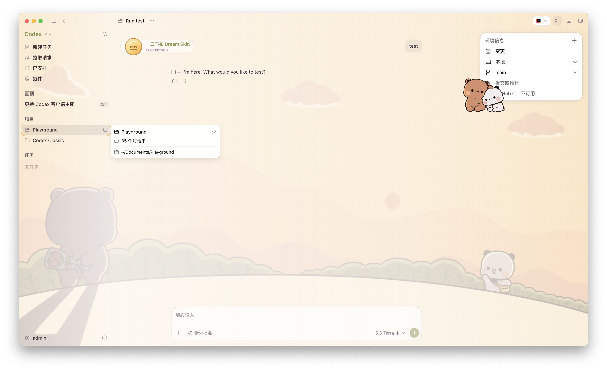

# 一二布布 Dream Skin for Codex

基于开源项目 [Fei-Away/Codex-Dream-Skin](https://github.com/Fei-Away/Codex-Dream-Skin) 二次修改的一套 Codex Desktop 主题。

这个仓库同时包含：

- 原项目的 Dream Skin 主题引擎
- 我定制的「一二布布」主题包

也就是说，clone 整个仓库后，不只是拿到几张图片，而是拿到一套可以安装和切换主题的完整工程。

## 主题效果展示



## 原项目做了什么

原项目 `Fei-Away/Codex-Dream-Skin` 主要负责：

- 为官方 Codex Desktop 提供主题注入能力
- 通过本机回环 CDP 方式应用主题
- 提供背景图主题和主题配置加载机制
- 提供 macOS 安装、切换、恢复脚本

## 这个仓库改了什么

在原项目基础上，这个仓库主要做了以下定制：

### 1. 一二布布主题素材

- 主背景图替换为 `erbu2.png`
- 角色挂件替换为布布相关素材
- `heroSticker` 使用透明底贴图 `erbu3-cutout.png`
- 品牌区图标使用圆形角标图 `corner-badge.svg`

### 2. 主题视觉统一

- 将默认的强调色改成更贴近背景灌木的绿色系
- 统一按钮、标签、边框、选中态的视觉语言
- 让背景、角色和控件颜色更协调

### 3. 针对角色主题的逻辑扩展

- 扩展并修正 `decor` 配置项的使用
- 支持 `brandIcon`、`heroSticker` 等装饰图接入
- 修正 `offsetX / offsetY` 在配置到渲染链路中的传递问题
- 增加源码主题同步到 live 目录的一键脚本

## 平台支持

- macOS：支持原项目底座，也已经集成好当前这套「一二布布」主题
- Windows：现在也已经集成可直接使用的 Windows 版「一二布布」主题

## 主题目录

这套主题主要位于：

- `macos/examples/bubu-theme-pack/`

核心文件包括：

- `theme.json`
- `erbu2.png`
- `erbu3-cutout.png`
- `corner-badge.svg`
- `sync-live-theme.sh`
- `Sync Bubu Theme.command`

## 使用方式

先说明一件最重要的事：

这套「一二布布」主题不是单独双击图片就能生效，它依赖仓库里的 Dream Skin 底座脚本。第一次使用时，要先安装底座，再同步主题。

### 第一步：安装 Dream Skin 底座

在仓库根目录执行：

```bash
cd macos
./scripts/install-dream-skin-macos.sh --no-launch
```

安装完成后，Dream Skin 的运行脚本会被放到：

```text
~/.codex/codex-dream-skin-studio/
```

### 修改源码主题

主要编辑：

- `macos/examples/bubu-theme-pack/theme.json`
- `macos/examples/bubu-theme-pack/` 下的素材文件

### 同步并应用

运行：

```bash
./macos/examples/bubu-theme-pack/sync-live-theme.sh --apply
```

或者直接双击：

```text
macos/examples/bubu-theme-pack/Sync Bubu Theme.command
```

它会自动做三件事：

1. 把主题源码同步到本机主题库
2. 覆盖当前生效的 live 主题目录
3. 调用已安装好的 Dream Skin 脚本立即应用主题

如果这一步报错，通常说明你还没有先执行上面的安装步骤。

## 源码目录和 live 目录

开发时最容易混淆的是这两份路径：

- 源码目录：
  - `macos/examples/bubu-theme-pack/`
- 当前生效的 live 目录：
  - `~/Library/Application Support/CodexDreamSkinStudio/theme/`

建议工作流：

1. 只改源码目录
2. 用同步脚本覆盖 live 目录
3. 立即应用查看效果

## 给使用者的最短步骤

如果你只是想直接用这套主题，而不是继续改源码，按下面走就行：

1. 安装官方 Codex Desktop，并至少启动过一次
2. clone 本仓库
3. 进入 `macos/` 目录执行 `./scripts/install-dream-skin-macos.sh --no-launch`
4. 回到仓库根目录执行 `./macos/examples/bubu-theme-pack/sync-live-theme.sh --apply`

做到这里，这套一二布布主题才会真正被应用上。

## 注意事项

- 请遵守原项目的开源协议
- 请确认背景图、角色图和衍生素材具备公开分发权限
- 本项目不修改官方 `.app` 安装包，依赖原项目的主题注入机制
- 两个平台都已提供可直接使用的 ERBU 主题，但视觉实现细节有所不同

## 致谢

感谢原项目作者提供完整的主题底座，让角色化、自定义化的 Codex Desktop 主题成为可能。
